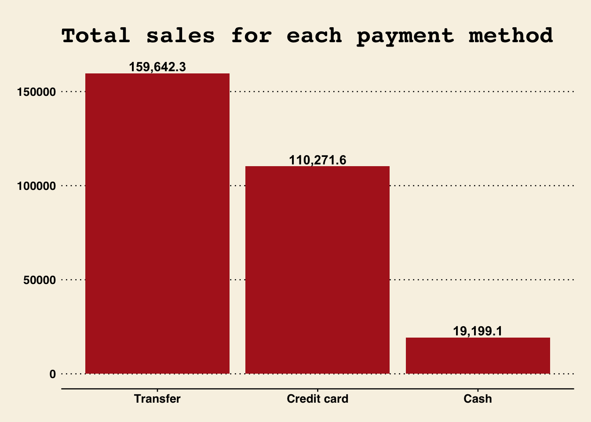
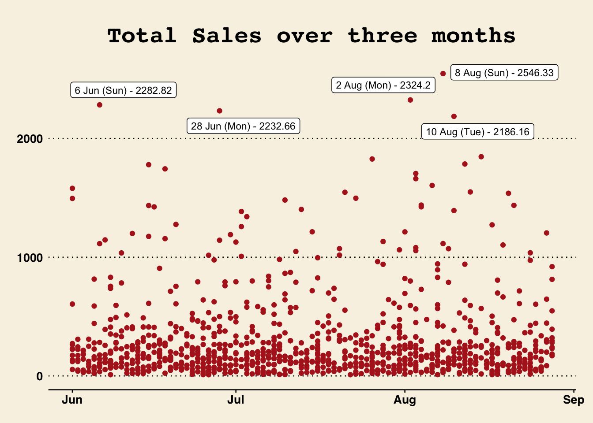

# Data Science using R

A collection of reports and scripts where I use R to analyze, visualize, and solve problems related to data science.

## Sales Data Report

Answered the following questions based on a Motorcycle Parts sales data report.

- What are the total sales for each payment method?
- What is the average unit price for each product line?
- What is the average purchase value by client type?
- What is the total purchase value by product line?
- What does the total sales over time look like?
- What are the total sales by month?

- [Optional] Investigate further (e.g., average purchase value by client type, total purchase value by product line, etc.)
  Summarize your findings.

Below are examples of plots created for the analysis

  
   

[View report](https://benthecoder.github.io/data-science-w-R/sales-data-report/report.html)

## Website Redesign A/B testing

- Analyzed the conversion rates for each of the four groups: the new/old design of the landing page and the new/old pictures and calculated uplift
- Performed AB testing to determine whether increase in conversion was due to randomness or it is statistically significant

Below is the output of t-test done for AB testing (made with formattable)

  

[View report](https://benthecoder.github.io/data-science-w-R/website-redesign/report.html)
